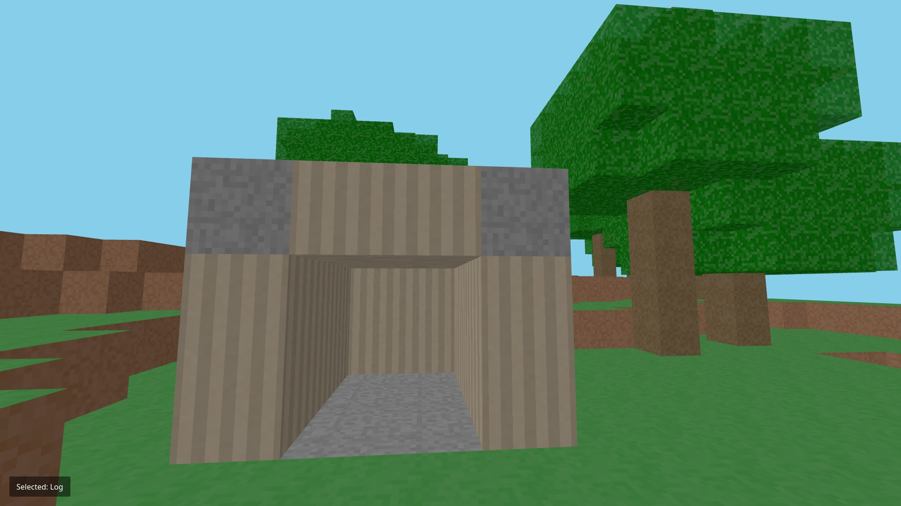

# Minecraft Clone

A lightweight Minecraft-inspired voxel game built with Three.js that runs directly in your browser.



## Features

- 🏗️ Break and place different types of blocks
- 🌍 Procedurally generated terrain with trees
- 🧱 Multiple block types (Dirt, Grass, Stone, Wood, Leaves, Planks)
- 🏃‍♂️ First-person controls with physics (jumping, gravity)
- 🎮 Simple and intuitive controls

## How to Play

1. **Click on the game window** to enable mouse lock and controls
2. **Movement**: 
   - W, A, S, D - Move around
   - SPACE - Jump
   - Mouse - Look around
3. **Block Interaction**:
   - Left Click - Break blocks
   - Right Click - Place blocks
4. **Block Selection**:
   - 1 - Stone
   - 2 - Dirt
   - 3 - Grass
   - 4 - Wood Log
   - 5 - Leaves
   - 6 - Wood Planks

Press ESC to exit mouse lock mode.

## Installation

1. Make sure you have [Node.js](https://nodejs.org/) installed.
2. Clone this repository:
   ```
   git clone <repository-url>
   cd minecraft-clone
   ```
3. Install dependencies:
   ```
   npm install
   ```

## Running the Game

Start the development server:

```
npm run dev
```

Open your browser and navigate to:

```
http://localhost:8000
```

## Technical Details

This project is built with:

- **Three.js** - For 3D rendering
- **simplex-noise** - For procedural terrain generation
- **PointerLockControls** - For first-person camera controls

The game uses:
- Procedural texture generation with HTML Canvas
- Raycasting for block placement and breaking
- Physics simulation for player movement

## Future Improvements

- Water and lava blocks
- Block breaking animations and sounds
- Inventory system
- Saving and loading worlds
- Multiplayer functionality
- More block types and crafting
- Day/night cycle
- AI generated and AI powered textures and entities

## License

This project is licensed under the MIT License - see the LICENSE file for details.

## Credits

Created as a learning project for 3D graphics and game development with Three.js. 
